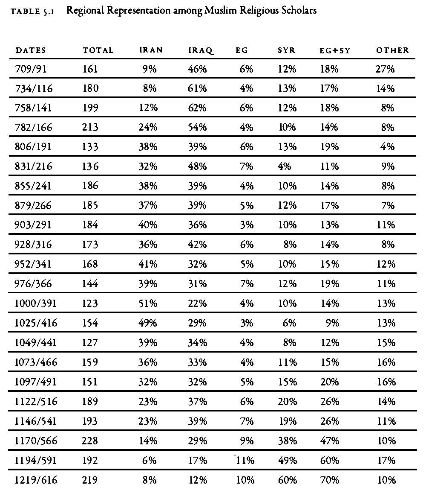
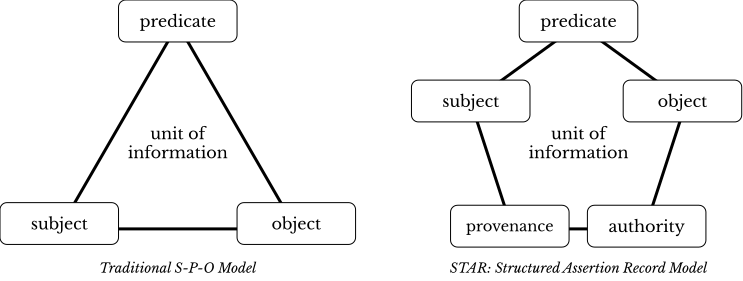
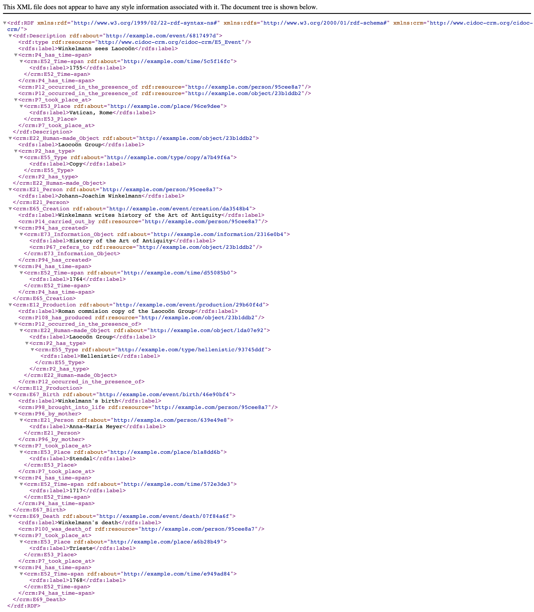

# Getting Your Data Right 

## This Chapter

- we will discuss how to get your data into a proper shape:
	- how to extract data from printed sources;
	- how to “tidy” your data, that is to say to how prepare it for the use with the tidyverse approach; how to normalize your data, which is also a part of tidying your data;
	- how to model your data, which is about getting more from your data during analyses;
	- then, we will look into the audition certificates data in its original format and the format that we will be using in this class.

## 1. Getting your own data

### Ways of obtaining data

1.  Reusing already produced data
    -   One may require to mold data into a more fitting structure .
2.  Creating one’s own dataset
3.  Digitizing data from printed and/or hand-written sources

### Major formats

-   Relational databases or Tables/Spreadsheets (_tabular data_)?
    - Tabular format: tables; spreadsheets; CSV/TSV files;
-   _Unique identifiers_:
    -   tables with different data can be connected via _unique identifiers_
    -   **Note:** A relational database (rDB) is a collection of interconnected tables. Tables in an rDB are connected with each other via _unique identifiers_ which are usually automatically created by the database itself when new data is added.
	    - In the PUA data, we have `idPersonaje` in the main `personaje` table, and then in all the `personaje_x` tables, which connect individuals and their relevant descriptions. For example, we can connect `personaje` and `lugar` via `personaje_lugar` and analyze the geography of people from the database.
    -   One can maintain interconnected tables without creating a rDB with a _Linked Open Data_ approach (LOD); or, better *Linked Local Data* approach. The main idea is that we create unique identifiers to all entities that we use—then we can use these identifiers to expand our data either manually, semi-automatically, or automatically.

### Ways of obtaining data

1. Reusing already produced data
	* One may require to mold data into a more fitting structure.
2. Creating one's own dataset
3. Digitizing data from printed and/or hand-written sources

### Major formats

* Relational databases or Tables/Spreadsheets (*tabular data*)?
* Tabular format: tables; spreadsheets; CSV/TSV files.
* *Unique identifiers*:
	* tables with different data can be connected via *unique identifiers*
	* **Note:** A relational database (rDB) is a collection of interconnected tables. Tables in an rDB are connected with each other via *unique identifiers* which are usually automatically created by the database itself when new data is added.
	* One can maintain interconnected tables without creating a rDB: *Open Linked Data*; (*Local Linked Data*: you simply connect datasets that you create and have on your computer;)
	* **Example**: Table of the growth of cities. One table includes information on population over time; Another table includes coordinates of the cities from the dataset. It is more efficient and practical (reducing error rate from typos) to work on these tables separately, and connect them via unique identifiers of cities which are used in both tables.

#### Note on the `CSV`/`TSV` format

`CSV` stands for *comma-separated values*; `TSV` --- for *tab-separated values*.

Below is an examples of a CSV format. Here, the first line is the *header*, which provides the names of columns; each line is a row, while columns are separated with `,` commas.

```
DATE,West,East,DATE,West,East
4000 BCE,0,0,1 BCE/CE,0.12,0.08
3000 BCE,0.01,0,100 CE,0.12,0.08
2500 BCE,0.01,0,200 CE,0.11,0.07
2250 BCE,0.01,0,300 CE,0.10,0.07
2000 BCE,0.01,0,400 CE,0.09,0.07
1750 BCE,0.02,0,500 CE,0.07,0.08
1500 BCE,0.02,0.01,600 CE,0.04,0.09
1400 BCE,0.03,0.01,700 CE,0.04,0.11
1300 BCE,0.03,0.01,800 CE,0.04,0.07
1200 BCE,0.04,0.02,900 CE,0.05,0.07
1100 BCE,0.03,0.02,1000 CE,0.06,0.08
1000 BCE,0.03,0.03,1100 CE,0.07,0.09
900 BCE,0.04,0.03,1200 CE,0.08,0.09
800 BCE,0.05,0.02,1300 CE,0.09,0.11
700 BCE,0.07,0.02,1400 CE,0.11,0.12
600 BCE,0.07,0.03,1500 CE,0.13,0.10
500 BCE,0.08,0.04,1600 CE,0.18,0.12
400 BCE,0.09,0.05,1700 CE,0.35,0.15
300 BCE,0.09,0.06,1800 CE,0.50,0.12
200 BCE,0.10,0.07,1900 CE,5.00,1.00
100 BCE,0.11,0.08,2000 CE,250.00,12.50
```

**Example for pasting into Excel**: the very last value will be misinterpreted. (The example is: War-making capacity since 4000 BCE (in social development points), from: Morris, Ian. 2013. *The Measure of Civilization: How Social Development Decides the Fate of Nations*. Princeton: Princeton University Press.)

`TSV` is a better option than a `CSV`, since TAB characters (`\t`) are very unlikely to appear in values.

Neither `TSV` not `CSV` are good for preserving *new line characters* (`\n`)—or, in other words, text split into multiple lines/paragraphs. As a workaround, one can convert `\n` into some unlikely-to-occur character combination (for example, `;;;`), which would be easy to restore into `\n` later, if necessary.

<!--
EXTRA NOTES

https://lsru.github.io/tv_course/lecture05_tidyr.html#1
https://arxiv.org/abs/1809.02264
https://cran.r-project.org/web/packages/tidyr/vignettes/tidy-data.html
http://vita.had.co.nz/papers/tidy-data.html // https://vita.had.co.nz/papers/tidy-data.pdf

Jeff Leek in his book The Elements of Data Analytic Style (Jeff Leek, The Elements of Data Analytic Style, Leanpub, 2015-03-02) summarizes the characteristics of tidy data as the points:[3]

Each variable you measure should be in one column.
Each different observation of that variable should be in a different row.
There should be one table for each "kind" of variable.
If you have multiple tables, they should include a column in the table that allows them to be linked.
-->


## 2. Tidying Data

### Basic principles of organizing data: *Tidy Data*

Tidy data is a concept in data organization and management introduced by statistician Hadley Wickham. It refers to a specific structure of organizing data sets in a way that is easy to analyze and manipulate, typically in the context of data science and statistical analysis. Tidy data adheres to the following principles:

1.  **Each variable is in its own column**: This means that every column represents a single variable or feature, making it easy to understand and analyze the data.
2.  **Each observation is in its own row**: This ensures that each row represents a unique observation or data point, allowing for simple indexing and filtering of the data.
3.  **Each value is in its own cell**: By having individual values in separate cells, the data is clearly organized and easy to manipulate or analyze using various data processing tools and techniques.

The need to use tidy data arises for several reasons:

1.  Simplified analysis: Tidy data makes it easier to perform exploratory data analysis, as the consistent organization allows for the straightforward application of various data manipulation and statistical analysis techniques.
2.  Improved readability: The structure of tidy data is intuitive and easy to understand, even for those with limited experience in data analysis. This makes the data more accessible for interpretation, collaboration, and communication.
3.  Code efficiency: With a consistent data structure, analysts can write more efficient and reusable code, as the same functions can be applied across various tidy data sets. For example, you can create an analytical routine in R that requires your data to be in a specific format—after that you can take any relevant data, convert it into the needed structure and simply reuse your R routine.
4.  Reduced errors: Tidy data reduces the potential for errors in data analysis by minimizing the need for manual data reshaping and transformation, which can introduce errors or inconsistencies.
5.  Better data quality: Tidy data encourages good data management practices by promoting the organization of data in a clear and consistent manner, making it easier to identify and address data quality issues.

In summary, adopting tidy data principles helps streamline data analysis processes, enhance collaboration, and improve the overall quality and accuracy of data-driven insights.

> **The original paper:** Wickham, Hadley. 2014. “Tidy Data.” *Journal of Statistical Software 59 (10)*. <https://doi.org/10.18637/jss.v059.i10>. (The article in open access)

### Clean Data / Tidy Data: *additional explanations*

* Column names and row names are easy to use and informative. In general, it is a good practice to avoid `spaces` and special characters.
	* Good example: `western_cities`
	* Alternative good example: `WesternCities`
	* Bad example: `Western Cities (only the largest)`
* Obvious mistakes in the data have been removed:
* Date format: `YYYY-MM-DD` is the most reliable format. Any thoughts why?
* There should be no empty `cells`:
		* If you have them, it might be that your data is not organized properly.
		* If your data is organized properly, `NA` must be used as an explicit indication that data point is not available.
* Each cell must contain only one piece of data.
* Variable values must be internally consistent
	* Be consistent in coding your values: `M` and `man` are different values computationally, but may have the same meaning in the dataset;
	* Keep track of your categories, i.e., keep a separate document where all codes used in the data set are explained.
* Preserve original values:
	* If you are working with a historical dataset, it will most likely be inconsistent.
		* For example, distances between cities are given in different formats: days of travel, miles, *farsaḫ*s/parasangs, etc.).
		* Instead of replacing original values, it is better to create an additional column, where this information will be homogenized according to some principle.
		* Keeping original data will allow to homogenize data in multiple ways (example: *day of travel*).
	* Clearly differentiate between the *original* and *modified/modeled* values.
		* The use of suffixes can be convenient: `Distance_Orig` *vs* `Distance_Modified`.
* Most of editing operations should be performed in software other than R; any spreadsheet program will work, unless it cannot export into CSV/TSV format.
	* Keep in mind that if you prepare your data in an Excel-like program, rich formatting (like manual highlights, bolds, and italics) is not *data* and it will be lost, when you export your data into CSV/TSV format.
	* Keep in mind also that programs like Excel tend to overdo it. For example, they may try to guess the format of a cell and do something with your data that you do not want. (**Example for pasting into Excel**) 
	* **Note:** It might be useful, however, to use rule-based highlighting in order, for example, to identify bad values that need to be fixed.
* Back up your data! In order to avoid any data loss, you need to have a good strategy to preserve your data periodically.
	* <http://github.com> is a great place for this, plus it allows to work collaboratively.
	* **Google spreadsheets** is a decent alternative as it allows multiple people to work on the same dataset, but it lacks version control and detailed tracking of changes.

**Example for pasting into Excel**: the very last value will be misinterpreted. (The example is: War-making capacity since 4000 BCE (in social development points), from: Morris, Ian. 2013. *The Measure of Civilization: How Social Development Decides the Fate of Nations*. Princeton: Princeton University Press.)


```
DATE,West,East,DATE,West,East
4000 BCE,0,0,1 BCE/CE,0.12,0.08
3000 BCE,0.01,0,100 CE,0.12,0.08
2500 BCE,0.01,0,200 CE,0.11,0.07
2250 BCE,0.01,0,300 CE,0.10,0.07
2000 BCE,0.01,0,400 CE,0.09,0.07
1750 BCE,0.02,0,500 CE,0.07,0.08
1500 BCE,0.02,0.01,600 CE,0.04,0.09
1400 BCE,0.03,0.01,700 CE,0.04,0.11
1300 BCE,0.03,0.01,800 CE,0.04,0.07
1200 BCE,0.04,0.02,900 CE,0.05,0.07
1100 BCE,0.03,0.02,1000 CE,0.06,0.08
1000 BCE,0.03,0.03,1100 CE,0.07,0.09
900 BCE,0.04,0.03,1200 CE,0.08,0.09
800 BCE,0.05,0.02,1300 CE,0.09,0.11
700 BCE,0.07,0.02,1400 CE,0.11,0.12
600 BCE,0.07,0.03,1500 CE,0.13,0.10
500 BCE,0.08,0.04,1600 CE,0.18,0.12
400 BCE,0.09,0.05,1700 CE,0.35,0.15
300 BCE,0.09,0.06,1800 CE,0.50,0.12
200 BCE,0.10,0.07,1900 CE,5.00,1.00
100 BCE,0.11,0.08,2000 CE,250.00,12.50
```


### *Discussion*: “A Bulliet Dataset”

||
|:---------------------------------------------------------------------------------|
|**Dataset:** The dataset shows chrono-geographical distribution of Islamic scholars, according to one of the medieval biographical sources. Source: Bulliet, Richard W. 2009. *Cotton, Climate, and Camels in Early Islamic Iran: A Moment in World History*. New York: Columbia University Press. P. 139|

* This data is formatted for presentation in a book; for data analysis this data needs to be converted into tidy format.
* What should be corrected? Think of how the data should look so that we could analyze it?

## 3. Modeling Data

### Categorization as a Way of modeling data

> “[Modeling is] a continual process of coming to know by manipulating representations.”

>> Willard McCarty, “Modeling: A Study in Words and Meanings,” in Susan Schreibman, Ray Siemens, and John Unsworth, *A New Companion to Digital Humanities*, 2nd ed. (Chichester, UK, 2016), <http://www.digitalhumanities.org/companion/>.

One of the most common way of modeling data in historical research—joining items into broader categories. Categorization is important because it allows to group items with low frequencies into items with higher frequencies, and through those discern patterns and trends. Additionally, alternative categorizations allow one to test different perspectives on historical data.

The overall process is rather simple in terms of technological implementation, but is quite complex in terms of subject knowledge and specialized expertise which is required to make well-informed decisions.

* For example, let's say we have the following categories: *baker*, *blacksmith*, *coppersmith*, *confectioner*, and *goldsmith*.
	* These can be categorized as **occupations**;
	* Additionally, *blacksmith*, *coppersmith*, and *goldsmith* can also be categorized as **'metal industry'**, while *baker* and *confectioner*, can be categorized as **'food industry'**;
	* Yet even more, one might want to introduce additional categories, such as **luxury production** to include items like *goldsmith* and *confectioner*; and **regular production** for items like *baker*, *blacksmith*, *coppersmith*.
* Such categorizations can be created in two different ways, with each having its advantages:
	* first, one can create them as additional columns. This approach will allow to always have the original—or alternative—classifications at hand, which is helpful for re-thinking classifications and creating alternative ones where items will be reclassified differently, based on a  different set of assumptions about your subject.
	* second, these can be created in separate files, which might be easier as one does not have to stare at existing classifications and therefore will be less influenced by them in making classification decisions.
* Additionally, one can use some pre-existing classifications that have already been created in academic literature. These most likely need to be digitized and converted into properly formatted data, as we discussed above.

### Normalization

This is a rather simple, yet important procedure, which is, on the technical side, very similar to what was described above. In essence, the main goal of normalization is to remove insignificant differences that may hinder analysis.

* Most common examples would be:
	* bringing information to the same format (e.g., dates, names, etc.)
	* unifying spelling differences

It is a safe practice to **preserve the initial data**, creating *normalized* data in separate columns (or tables)

### Note: *Proxies*, *Features*, *Abstractions*

These are the terms that refer to the same idea. The notion of *proxies* is used in data visualization, that of *features*—in computer science; that of *abstractions*—in the humanities (see, for example, Franco Moretti’s *Graph, Maps, Trees*).

The main idea behind these terms is that some simple *features* of an object can act as *proxies* to some complex phenomena. For example, we can use individuals who are described as “jurists” as a proxy for the development of Islamic law. This way we use onomastic information as a proxy to the social history of Islamic law.

<!--For example, Ian Morris uses the size of cities as a proxy to the complexity of social organization. The logic is following: the larger the size of a city, the more complex social, economic and technical organization is required to keep that city functional, therefore it alone can be used as an indicator of the social complexity (or a proxy to the social complexity). -->

While *proxies* are selected from what is available—usually not much, especially when it comes to historical data—as a way to approach something more complex. It may also be argued that *abstraction*s are often arrived to from the opposite direction: we start with an object which is available in its complexity—in the case of PUA, the starting point is biographies written in natural language (Arabic). The PUA researchers then reduced the complexity of biographies in natural language to a more manageable form which—we expect—would represent specific aspects of the initial complex object. From this perspective, the PUA database itself is an abstraction of biographies of Andalusians.

Most commonly (and automatically) abstractions are used with texts in natural languages. For example, in *stylometry* texts are reduced to frequency lists of most frequent *features*, which are expected to represent an *authorial fingerprint*. Using these frequency lists we can—with accuracy up to 99%—identify authors of particular texts. The complexity of texts can be reduced in a number of ways: into a list of lemmas (e.g., for topic modeling analysis), frequency lists (e.g., for document distance comparison, such as, for example, stylometry), keyword values (e.g., for identifying texts on a similar topic, using, for example, the TF-IDF method), syntactic structures, ngrams, etc. As you get to practice and experiment more, you will start coming up with your own ways of creating abstractions depending on your current research questions.


## Conceptual Structure for Your Data

... Let's first take a look at the original AC data ...


### Reorganization: Conceptual Model For Your Data

The model that you should choose depends significantly on what exactly you are doing. When the data is already collected and you are just reorganizing it for more efficiency, a much wider variety of approaches can be used. This is the case when the use of a relational database will be fully justified and very easy to implement, since the data is already collected—the most difficult and time-consuming part is already done.

It is a completely different case when you are only beginning to collect your data. In cases when your objects have a very clear set of attributes and information on all or most of those attributes is available or relatively easily acquirable, the reliance on relational databases could be quite efficient. The cases of such objects include actual physical objects and the set of their attributes include descriptions of their physical properties. For example, editions, manuscripts, etc.

In cases, when the set of attributed is not clear, relational databases will be significantly less efficient. Biographical/prosopographical data is one of such cases, mainly for the following reason. It is practically impossible to know beforehand what attributes will be of actual relevance; even though one may think that there is a clear set of attributes, the actual data from the sources may be skewed in a variety of ways not providing one with relevant data on most attributes. On the other hand, working with a particular source one inevitably discovers attributes that were not included in the initial thinking about a given problem, but happened to be important for thinking about specific groups of people. Relational databases are rather inflexible for modifications and would require significant re-design to be realigned with new realities of research.



In the previous lesson, I have mentioned the `subject-predicate-object` model, with which you can describe pretty much everything that you can describe with a subject-predicate-object sentence. The traditional `SPO` model, however, is not exactly perfect for our purposes, especially if we want to record conflicting information from different sources. For this purpose a somewhat different model has been proposed by Tara Andrews, the Professor of Digital Humanities at the University of Vienna. since she is also a historian, working on the medieval Armenian history, she is interested in recording both the provenance, i.e. where the information is taken from, and the authority, i.e. who is making this assertion—since even the same information in the same source may be read differently by two different scholars. To solve this issue, she proposed the structured assertion model (`STAR`), that you see on the right. Thus, with this model, we would have a five column table, instead of a three-column one.

Let's take a look at how STAR method is used in the OpenITI project. We can use the following piece of information as an example of how biographical data can be encoded using STAR method in plain text format:

>  al-Ḏahabī was a teacher (*tafaqqaha ʿalay-hi*) of al-Subkī in Damascus from 699 till 715 AH. (Source: a made-up example with the reference code `220607114503`)

Now, in order to do the actual encoding we use an ordered structure, URIs, and patterned statements. The ordered structure means that the category of data is defines by its location in our encoding statement (for example, the first element is always the subject, the second—always the predicate, etc.). The patterned statement means that we encode certain types of data with a sequence of characters that can be described with generalized patterns (`regular expressions`), which can later be used to both extract and interpret encoded data. The end result may look like the following statement, where five elements are connected with `@`, and details on all the coded information being available/collected in additional files (*linked local data*):

> `[0748Dhahabi@]teacherOf_tafaqqahaCalayhi@0771Subki;DIMASHQ_363E335N_S;699_XXX_XX-715_XXX_XX@MGR@MacrufDahabi1976s_1_345`


- The first element is the *subject*, which is recorded using the Author URI—`0748Dhahabi`; in order to simplify things, we most commonly omit the subject, since it is implied by the name of the file in which metadata is collected (more on this in the discussion of YML files with metadata);
- The second element is our *predicate*—`teacherOf_tafaqqahaCalayhi`. We use unrestricted vocabulary, since we are still at the research stage and this appears to be more productive to explore possibilities; the normalization of predicates will take place periodically during the revisions of metadata. As you may have noticed, there is a pattern in the predicate—there are two parts connected with the “underscore”, which allows us to record the predicate with the reference to its original form in Arabic (although, one can also use simply `teacherOf`, if no Arabic equivalent is available). This kind of encoding is particularly important for developing classification schemes, where one has to keep track of the original vocabulary (for example, relationships among books—different types of abridgments, continuations, commentaries, etc.). <!--Add a visualization?--> 
- The third element is our objects, of which we have three: 1) the “direct object”, which is a person also encoded with the Author URI (`771Subki`)—all individuals are to be encoded using such URIs;[^2206100431] 2) the “object of place”, which is encoded with the URI from an affiliated project al-Ṯurayyā (<https://althurayya.github.io/>)—all geographical entities are to be encoded with such URIs; 3) the “object of time”, which is encoded following a specific pattern `YYYY_MMM_DD` where sub-elements are also divided with an underscore. From this pattern we know that the first sub-element is the year, the second—the month, and the third—the day. In case, any of sub-elements are unknown, they are encoded with `X`s. For the encoding of a period of time, two date statements are connected with “-” (hyphen).
- The fourth element is authority, encoded with the pattern `AUTH_ContributorURI`, with `ContributorURIs` recorded in a separate file that contains additional information on all contributors to the project.
- The last, fifth element contains references, which can be encoded in a variety of ways. Here, we use `MacrufDahabi1976s_1_345`, which consists of three elements separated with `_`.   The first element is the `bibTeX` code of a publication (with the detailed information on the edition stored in a bibTex file with all the used bibliography), while the other two are the volume and page number. (**Note**: this reference is not real.)

**Note**: even if some elements seem complicated for you at the moment because you do not have enough skills to process them and convert them into something more useful, you should always strive for consistency in how you encode your data—if you want to be able to analyze that data computationally. For example, the reference `MacrufDahabi1976s_1_345` may seem weird, but it is structurally solid: there are three elements, separated with `_` and it is very easy to break this coded piece of information into distinct elements. You already know how to do that with R, where, using `tidyverse` approach (more specifically, functions from the family of `stringr`) you can break such references into three separate columns: reference, volume, page(s). Even if you do not know now how to do that, it is always important to plan ahead and focus on encoding your data in a consistent manner.

[^2206100431]: We are primarily interested in the relationships within the OpenITI projects, i.e., among works and among authors, but the coverage can be easily expanded to include non-authors.

Now, let’s talk a bit about how to practically implement these models. The STAR model is meant to fit into existing standards, like CIDOC-CRM or/and FRBR-OO (see, <https://cidoc-crm.org/collaborations>), and implement Linked Open Data (LOD) approach, i.e. linking into existing online datasets. Since we are focusing more on Linked Local Data (LLD) approach, we also want a more pragmatic—i.e., simple—implementation of the STAR model (CIDOC-CRM is a rather complicated standard, see below for an example).

||
|:-:|
|CIDOC-CRM Encoding Example in RDF XML (`*.xml`). This examplecaptures a historical event, relevant for the history of art: Johann-Joachim Winkelmann (a German Scholar) has seen the so-called Laocoön Group in 1755 in the Vatican in Rome (at display in the Cortile del Belvedere). He described his impressions in 1764 in his “History of the Art of Antiquity”, (being the first to articulate the difference between Greek, Greco-Roman and Roman art, characterizing Greek art with the famous words “...noble simplicity, silent grandeur”). The sculpture, in Hellenistic "Pergamene baroque" style, is widely assumed to be a copy, made between 27 BC and 68 AD (following a Roman commission) from a Greek (no more extent) original. Johann-Joachim Winkelmann was born 1717 as child of Martin Winkelmann and Anna-Maria Meyer and died in 1768 in Trieste. <br>**Sources**: <https://www.cidoc-crm.org/sites/default/files/Winkelmann_time_label_1.xml>; <https://cidoc-crm.org/sites/default/files/CIDOC%20CRM_v.7.0_%2020-6-2020.pdf>|

In fact, depending on your sources and your final goals, you can opt for one of the following three variations.

1. As we discussed the simplest variation will be the `S-P-O` model, with `SUBJECT`, `PREDICATE`, and `OBJECT`. (As you can see, the `SUBJECT` is repeated many times, so, technically, one can simplify the data encoding even further, by keeping separate files for each person, and then having only `PREDICATE` and `OBJECT` columns—the `SUBJECT` will be encoded in the name of the file.):


2. If your assertions are simple (i.e., they have single objects), you can use a “simple” STAR model, where we add `PROVENANCE` and `AUTHORITY`:


3. If your assertions have multiple objects, then we would need a “robust”  STAR model with an additional column for `AssertionID`. The complex event has id `17`, where we describe that “al-Ḏahabī was a teacher (*tafaqqaha ʿalay-hi*) of al-Subkī in Damascus from 699 till 715 AH. (Source: a made-up example with the reference code `220607114503`)”:


**Note:** Please, watch Tara Andrews’ presentation “How Might We Make Data Collections More Useful for Historians?”  (<https://www.youtube.com/watch?v=JcBdthObApY>) on the STAR model.

**The advantages of such models:**

- they are *symmetrical*, i.e. you always know which column contains which data. This means you can easily manipulate this data in R.
	- when you load this kind of data into R, you can recursively query your dataset. For example, if you want to find people who died in, say, Qurṭubaŧ, you can filter `OBJECT` to find all instances of `QURTUBA_047W379N_S`; then limit your results to `PREDICATE` == `place_died`. Then you would get all the unique IDs from `SUBJECT`. Then you will filter  `date_died` (in `PREDICATE`) by the unique IDs that you got in the previous step. And now you have all the death dates of people who died in Qurṭubaŧ (don't forget to pick a single date from `date_died` data!).
- they are *expandable*, since you can easily encode new types of information by simply introducing new predicates, and without changing the main structure of your data.
	- Please, note how predicates are named: a broader category is followed by a subcategory, separated with `_`; This will allow you to easily pull out dates, places, etc.
	- Keep in mind that there is no single correct way of modeling your predicates. this is something that you should periodically revise and improve. It helps to keep a visual scheme of your predicates and playing around with it, until you arrive to some stable scheme that allows you to encode everything you need.
- they allow to *implement the Linked Data approach locally* (i.e., Linked Local Data):
	- for example, for places, I used settlement IDs from the al-Ṯurayyā Gazetteer (<https://althurayya.github.io/>); you can download and keep al-Ṯurayyā data in a TSV file and you can get coordinates and settlement classifications from this file easily. If some places are missing, you can expand the original al-Ṯurayyā dataset by adding new places into it (and assigning new IDs following the same pattern, but perhaps adding some suffix that would indicate that this place was not originally in al-Ṯurayyā).
	- for authorities, if you have many of those, you can also keep a file with all the additional descriptions that would be connected to the IDs used in the main table.
	- similarly for predicates (`PREDICATE`) and references (`PROVENANCE`), as well as other columns, as need arises.
	- you will want to keep a master document where you would describe all other conventions that you adopt for your research project (for example, date encoding.)


I have mentioned above the traditional `subject-predicate-object` model, with which you can describe pretty much everything that you can describe with a subject-predicate-object sentence. 


## Reference Materials

* Wickham, Hadley. 2014. “Tidy Data.” *Journal of Statistical Software 59 (10)*. <https://doi.org/10.18637/jss.v059.i10>. (The article in open access)
* Check these slides: A. Ginolhac, E. Koncina, R. Krause. *Principles of Tidy Data: tidyr* <https://lsru.github.io/tv_course/lecture05_tidyr.html> (Also check their other lectures/slides: )
* Broman, Karl W., and Kara H. Woo. 2018. “Data Organization in Spreadsheets.” *The American Statistician* 72 (1): 2–10. <https://doi.org/10.1080/00031305.2017.1375989>.

The following book is a great example of modeling data for historical studies:

* Bulliet, Richard. 1979. *Conversion to Islam in the Medieval Period: An Essay in Quantitative History*. Cambridge: Harvard University Press.
* Morris, Ian. 2013. *The Measure of Civilization: How Social Development Decides the Fate of Nations*. Princeton: Princeton University Press.
	* **Note:** This book is a methodological companion to: Morris, Ian. 2010. *Why the West Rules—for Now: The Patterns of History, and What They Reveal about the Future.* New York: Farrar, Straus and Giroux.


## Appendix: OCR in R

As was noted above, we can use R to OCR text in PDFs and images. The following libraries will be necessary.

```{r eval=FALSE, include=TRUE}
library(pdftools)
library(tidyverse)
library(tesseract)
library(readr)
```

This code we can use to OCR individual PNG files.

```{r eval=FALSE, include=TRUE}
text <- tesseract::ocr(pathToPNGfile, engine = tesseract("eng"))
readr::write_lines(text, str_replace(pathToPNGfile, ".png", ".txt"))
```

This code can be used to process entire PDFs:

```{r eval=FALSE, include=TRUE}
imagesToProcess <- pdftools::pdf_convert(pathToPDFfile, dpi = 600)
text <- tesseract::ocr(imagesToProcess, engine = tesseract("eng"))
readr::write_lines(text, str_replace(pathToPDFfile, ".pdf", ".txt"))
```

**NB:** I had issues running `pdftools` on Mac. Make sure that you install additional required tools for it. For more details, see: <https://github.com/ropensci/pdftools>.

More details on how to use Tesseract with R you can find here: <https://cran.r-project.org/web/packages/tesseract/vignettes/intro.html>

Tesseract---a separate software---must be installed first. The R library `tesseract` is simply a “wrapper application”, which essentially calls it from R. Using R scripts (or, Python scripts) can be particularly useful when one needs to process lots of different files in a particular manner. Thus, an R script will take care of all the additional steps, while Tesseract will only be called for one specific operation—optical character recognition.
