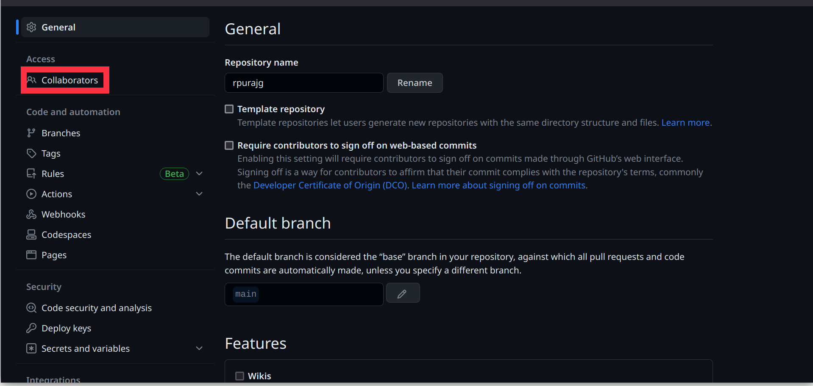
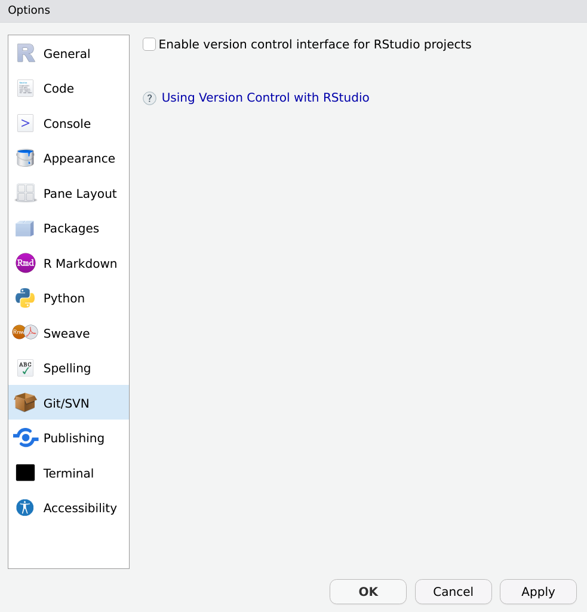
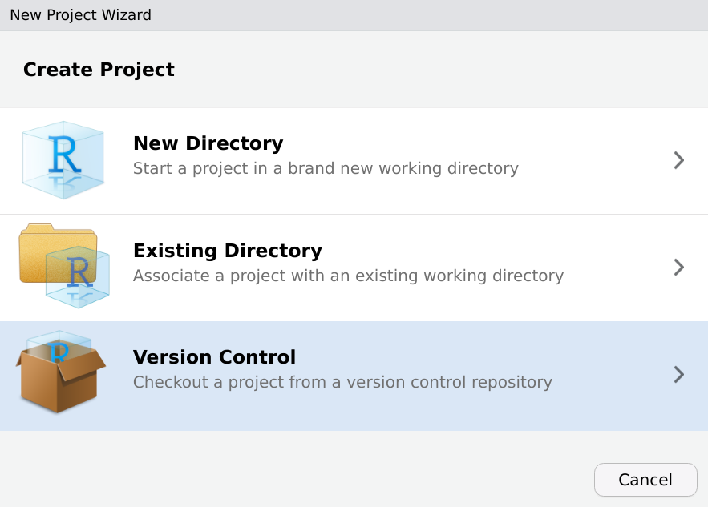
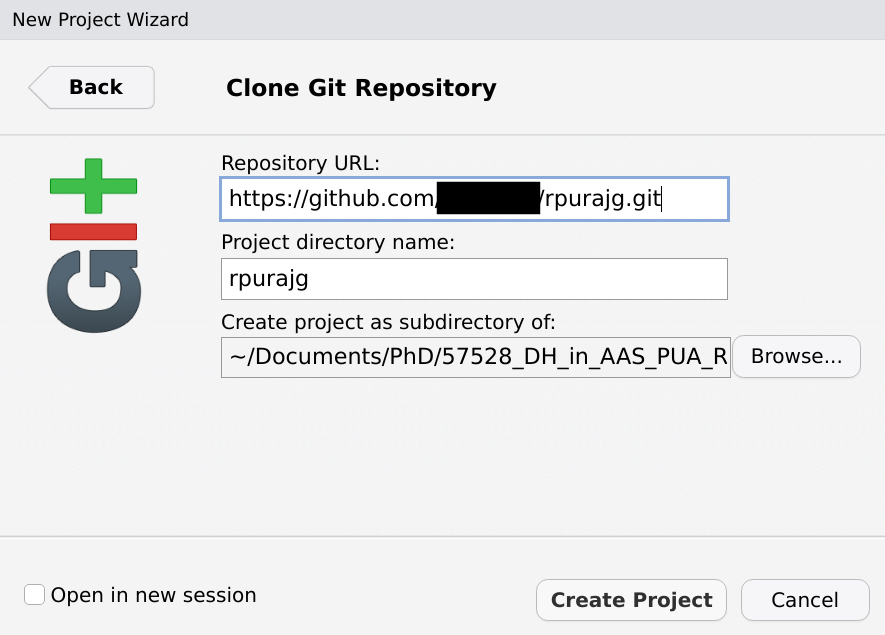

# An Introduction to Git, Github and RStudio's Git Integration

**Objectives:**

By the end of the session, students will be able to:

1. Understand the concept of version control and the benefits of using Git.
2. Set up a GitHub account and install Git.
3. Initialize and manage a local Git repository.
4. Connect a local repository to a remote GitHub repository.
5. Use RStudio's Git integration.

---

**Why bother?**

Digital humanists use technologies and computational methods to conduct research and project work in the humanities. Git and GitHub are two truly essential tools for any DH project. Here is the list of main reasons to consider:

1. **Version Control:** Digital humanists often work on complex projects that evolve over time. With Git, they can maintain different versions of their work and easily revert to previous versions if necessary. If anything is committed (i.e., saved), it practically cannot be lost and one can always go back to one of the saved states of the project. Project members can also start a new branch to experiment with ideas without affecting the main project.
    
2. **Collaboration:** Git facilitates collaborative work on a project. It provides a tool with which team members can work on the same project without overriding each other's work, thanks to its version control system.

3. **Transparency and Reproducibility:** By hosting their work on GitHub, digital humanists can make their methods and data transparent, which is crucial in academic research. Other researchers can reproduce their work, validate their findings, or build upon their projects. In case you want to keep your project to yourself, GitHub also offers “private” repositories which will be accessible only to you and those you explicitly share it with. 
    
4. **Publishing and Dissemination:** GitHub Pages offers a way for digital humanists to easily publish their projects online, which is particularly useful for creating project websites or online portfolios.
	1. Every GitHub user automatically gets an address like `username.github.io` to host their website. For example, Maxim Romanov's old website is <https://maximromanov.github.io/>; think carefully when you select your username. It makes a lot of sense to use firstNameLastName pattern.
	2. GitHub also offers integration with Zenodo, <https://zenodo.org/>, the official EU open science platform for publishing research projects and research data. Publishing your research data on Zenodo will create a citable version of your data (with DOI number) which will be preserved and made accessible by perhaps the most reliable academic agency. 
    
5. **Integration with other Tools:** Git can integrate with many other tools digital humanists might use, such as text editors, data visualization tools, digital exhibit software, and more.
    
6. **Preservation and Sustainability:** GitHub provides a durable and sustainable platform for preserving digital projects. By hosting their projects on GitHub, digital humanists ensure that their work remains accessible and usable for the long term.
	1. See the point on the integration with Zenodo above. 
    
7. **Issue Tracking and Task Management:** GitHub's issue tracking feature provides a way to organize tasks and track progress, making it useful for project management.
    
8. **Community and Learning:** Published source code on GitHub means that digital humanists can learn from others' projects and also contribute to projects outside their immediate team. This shared knowledge is a vital resource for skills development and innovation.
    

In sum, Git and GitHub offer digital humanists a set of tools to improve their workflows, make their work more accessible and transparent, and foster collaboration and learning.

---

**Materials Needed:**

1. Computers with internet access.
2. RStudio installed.
3. GitHub account (students should sign up before the lesson).
4. Git installed.
5. On iOS: SSH key (but recommended for all systems).

---

## Perks of Using Git

Git comes as a command line interface (CLI).
As a regular user of your system, you probably use graphical user interfaces (GUI) exclusively.
That means, most of your interactions with the system happen through navigation with your mouse cursor, you point the system to what you want it to do (visually/graphically).
An alternative to this type of navigating is to describe verbally to the system what you want to do through commands.
So after installing Git on your computer, you will not get a new application on your system - there is no icon you can use to point your system to that program.
Instead, you need to use your system's console to work with Git.
A console is a program whose type is *command line interpreter* - it takes written commands and executes these.
Depending on your system, your console is called:

* **iOS:** Terminal
* **Windows:** Bash, PowerShell, cmd
* **Linux:** Bash, Shell

For example, when you want to open the folder containing your project, with the GUI (your file browser, called *Explorer* for Windows and *Finder* for iOS), you just click on the folder and then the files inside that folder will be shown to you.
Say your folder is called `project` and inside that folder you have a text file called `abc.txt`.
You would click on the folder `project` and then you can see that it contains the file `abc.txt`.
The equivalent for that step in the console is typing:
```
cd project
```
which opens the folder `project`.
And then typing:
```
ls
```
which will list the files in that folder.

If you are not used to navigating in the console, there is a trick to avoid this step.
Open the folder of your project and do a right click.
Somewhere in the pop-up menu, there is an item called something like: 'Open Terminal' (Linux) or 'Git Bash here' (Windows).

**For iOS**, activate the *path bar* (in Finder go to options: *View* > *Show Path Bar*).
It will be shown at the bottom of your Finder window.
Right click in this *path bar* on your project folder and select 'Open in Terminal'.

## SSH Key

SSH key is an alternative authentication method to giving your user name and password.
As an iOS user this method is mandatory to connect with your Github account due to security reasons.
But it can be used by everyone who does not want to type in their user name and password all the time.

SSH key is a pair of two files which have the exact same name but one of the files has the ending `.pub`.
You never give the content without the `.pub` ending to any service, this file is only your computer and should kept secret - it is very sensible data because everyone who has that can authenticate as you.
Think about this file as the key to your home.
You do not want to share that with anybody unless you really want them in your home at any time.
For the other file, the ending `.pub` indicates that you can share it **pub**licly.
This is the part you will give to the service.

So first step is the creation of such a SSH key pair.
Github's documentation will guide you through that process - it differs depending on your system.
Do not forget to edit the SSH config file! 
[https://docs.github.com/en/authentication/connecting-to-github-with-ssh/generating-a-new-ssh-key-and-adding-it-to-the-ssh-agent](https://docs.github.com/en/authentication/connecting-to-github-with-ssh/generating-a-new-ssh-key-and-adding-it-to-the-ssh-agent)

You are strongly advised to put the SSH key in the hidden folder `.ssh` and NOT in your project folder.
Try to stick to Github's guide as tight as possible - again, this key is something you need to take care of very well.

After you finished the process of setting up your SSH key, we need to add a SSH config file.
For Windows, use PowerShell to navigate into your `.ssh` folder, on Linux or Mac use your bash (the command is the same for all three systems):
```
cd $HOME/.ssh/
```
Make sure you are in the correct place by typing `ls` which should list you your SSH key pair.
Now, let's create the `config` file.
In PowerShell:
```
New-Item config -ItemType File
```
On Linux or Mac:
```
touch config
```
Open that `config` file in an editor of your choice and add the following lines, just replace `<username>` with your actual Github username (and maybe change the `IdentityFile` path to your private key).
```
Host github.com
    HostName github.com
    User <username>
    IdentityFile ~/.ssh/id_ed25519
    IdentitiesOnly yes
```

Final step, test your setup! In Linux and Mac, just type the following command. On Windows, change back to cmd and enter the following command.
```
ssh -T git@github.com
```

---

## Local and Remote Repositories

Create a new remote repository and connect it with a local repository.
The local repository can be a new, empty repository or a folder where you have your data already but which was not set-up (i.e. initialized) as a git repository yet.
Start from creating the remote repository on Github since it will give you all the necessary instructions on how to set-up your local repository with git.

### Create new remote repository on Github

Go to GitHub and start a new repository there. In the top right corner on your start-page, there is a `+` button. Click it and the pop-up will show you multiple options. Select **New repository**.  


Start with giving your repository a meaningful name.
This name should be representative for your project as it will be used to search for your project, as well as for the URL of the project.
The URL for the repository will have the following pattern, where <user_name> is your user name and <project_name> is the name you are about to give the repository:
`https://github.com/<user_name>/<project_name>`
Is your work public or private?
Public means everyone can have a look at your files which you put on Github, private means you have to grant access to your repository before someone else can see it.
You can make a repository public at any time with just a few clicks but once your repository is out there, it is not as easy to make it private again.  


After successfully creating the repository, the next screen will give you instructions on how to push your local files to the new remote repository.  


Change to your files now and go to your local folder which you want to push to the remote repository.
Right-click there and select `Open Terminal` or `Git Bash here` or whatever your system provides.
Your console will open with the working directory set to your current folder.
Now you can execute the instructions from Github.
Please copy the commands from your Github and not from this tutorial.
They will differ a bit for you since this again depends on the system your on.
So please refer to the steps provided by Github.

First create the `README.md` file by:
```
echo "#<project_name>" >> README.md
```
The magical transformation from plain folder to repository happens with: 
```
git init
```
This command tells the folder to become a Git repository.
Next, create a `README.md` file (capitalizations is important) and add a short introduction/description to your project there. This will be shown to everyone who takes a look at your project.
Use 
```
git add .
``` 
or 
```
git add *
```
to add all the files from the folder to the git repository.
After this, you commit the files with:
```
git commit -m "first commit"
```
Now that you have a local repository, you need to connect it with the remote equivalent by executing:
```
git remote add origin <project_url>
```
Finally, bring your local repository to the remote Github repository by pushing it with 
```git push -u origin main```
If you go back to Github, you can see the pushed files there.  


Do not worry if this does not work with the first try.
You can repeat the steps, but before you do so make sure that you remove the **hidden** folder `.git`.
Since it is hidden, you probably need to activate the option to show hidden files and folders in your file browser (Finder, Explorer or whatever your system provides).

---

## Basic Git Commands

Now that you have you repository set-up, you can work with it.
Just work with your files as you have always done.
When you finished a step in your work, you not only save the file but now you will also do a commit. 
A commit commemorates the current state of the repository, so others can use that state as well and you can return to it any time.
If you mess up any step which follows the commit, you can simply return to the state of the commit.
Furthermore, you make that state accessible to all your collaborators and everyone who has access to the remote repository.
To do so, go back to your console.

1. **Git status:** Check which files have been modified by typing `git status`. This command will list you all the files which have been changed since the last commit. Red files are not marked for the current commit, green files will be commited.

2. **Git add:** `git status` probably shows you all the files as red. You can now add the files to your commit by `git add .` or `git add *`. This will add all changed files. If you only want to add an individual file, do `git add <file>` where <file> is the file name. If you run `git status` again, all files affected by `git add` are now listed in green.

3. **Git commit:** Now we tell Git to memorize the repository with all the changed files by `git commit -m "<commit_message>"`. Use the commit message to describe the changes or the current state in a few words.

4. **Git push:** Push the local commit to the remote repository, so this state is accessible to everyone by `git push`.

5. **Git pull:** Everyone who wants to continue working with the new state and the latest changes will use `git pull` and the commit is pulled from the remote repository to their local one. 

---

## Git and Collaboration

Before anyone else than you can make changes to your project, you need to invite this person as a collaborator to your project.
On Github, navigate to our projects settings.
The first item in the settings menu is `Collaborators`.
Click on it and in the next step you have to enter the user name of the person you want to add as a collaborator to your project.  
  
This person will then receive an email with an invitation they have to accept.
After accepting the invitation, this person can push to your project.
You can grand different types of access.
If your project is private, you can add persons to the project with only read and pull rights.
That means the person can see the project, but is not allowed to make changes to your project with push.

---

## Git and RStudio

RStudio has an integration for Git.
To activate the integration, go to: `Tools > Global Options`.
Select `Git/SVN`.  


When you start a new project, you can now select `Version Controll` and check out the repository directly into RStudio.  

    
To clone the repository, give the necessary information.
You can also define the path as to where that repository is cloned to on your computer.  


You can now do the status, add, commit, push and pull commands with RStudio.
Go to `Tools > Version Controll > Commit...`.
Select the files you want to commit as `Staged` by ticking the check-box.
RStudio will also highlight the changes made in that file. I edited the `README.md` and all the changes I have done are now listed at the bottom.
Do not forget to give a commit message!  


---

## Additional Materials

-  Paul Vierthaler, “A quick Git and Github Tutorial”, a video tutorial <https://www.youtube.com/watch?v=YetC-gxgIVY&list=PL6kqrM2i6BPIpEF5yHPNkYhjHm-FYWh17&index=22>;  Watch this tutorial. It will help you to go over the new material and pick up a few more useful `git` _&_ `gitHub` tricks.
- A recommended detailed tutorial: <https://swcarpentry.github.io/git-novice/>
